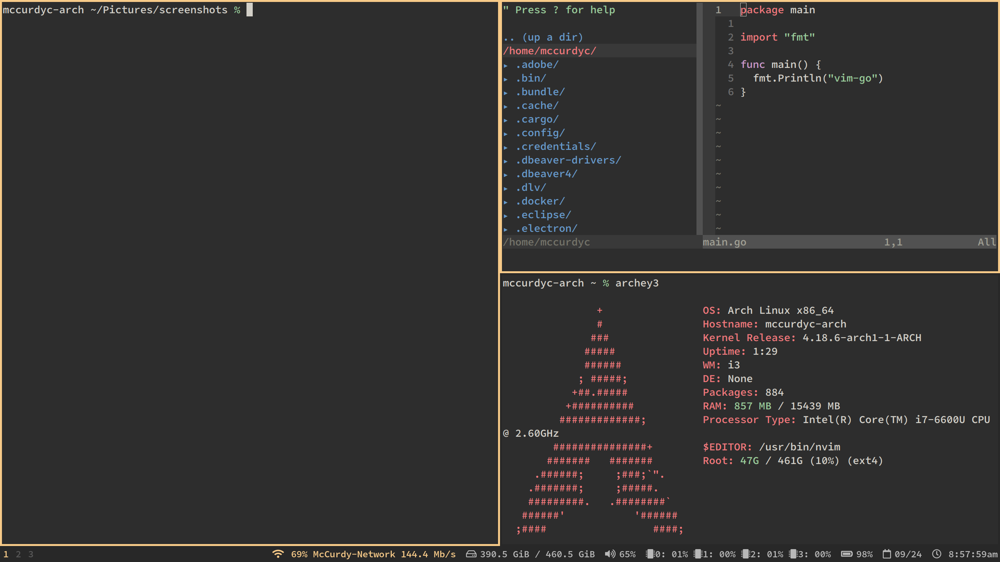

# dotfiles



## Getting Started
```
make
```

Please, whatever you do, do not just blindly copy and paste ANYONE's dotfiles, it will cause more harm than benefit and you will spend hours debugging! Take small bits at a time and make sure you understand what you are taking.

## System Information
+ Terminal Emulator: [urxvt](https://wiki.archlinux.org/index.php/rxvt-unicode)
+ Shell: [Zsh (NOT Oh-My-Zsh)](https://wiki.archlinux.org/index.php/zsh)
+ Window Manager: [i3](https://i3wm.org/)
+ Editor: [NeoVim](https://neovim.io/)
+ Operating System: [Arch Linux](https://www.archlinux.org/)
+ Kernel Release: 4.18.6-arch1-1-ARCH
+ Processor Type: Intel(R) Core(TM) i7-6600U CPU @ 2.60GHz
+ RAM: 1431 MB / 15439 MB
+ Disk Space: Root: 47G / 461G (10%) (ext4)

## Todo
+ fix prompt to display branch
+ remove the MacOS-specific files (do checks instead)

## Sources of Inspiration
+ [@delgrecoj's dotfiles](https://github.com/delgrecoj/nix)
+ [@gkapfham's dotfiles](https://github.com/gkapfham/dotfiles)
+ [@jessfraz's dotfiles](https://github.com/jessfraz/dotfile://github.com/jessfraz/dotfiles)
+ [urxvt video](https://www.youtube.com/watch?v=eaBf_yFHps8)
+ [open terminal in last working directory](https://www.reddit.com/r/i3wm/comments/6ugxvk/set_working_directory_for_terminal/dlsntaw)


## Bugs or Praise
If you find these files useful or find a bug, please let me know.

I'm @McCurdyColton on Twitter, but also feel free to open an issue here!

