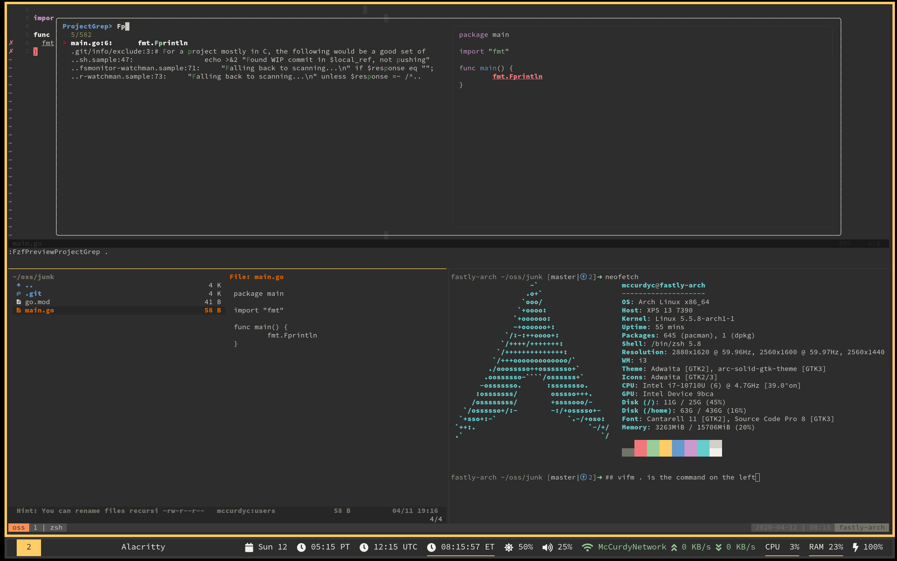

## Getting Started
```
$ git clone --recursive https://github.com/mccurdyc/dotfiles.git
$ cd dotfiles && git submodule update --init --recursive
$ make help
$ make run # idempotent
$ make HEADLESS=false run # non-headless
```

Please, whatever you do, do not just blindly copy and paste ANYONE's dotfiles, it will cause more harm than benefit and you will spend hours debugging! Take small bits at a time and make sure you understand what you are taking.

## System Information
+ Terminal Emulator: [alacritty](https://github.com/alacritty/alacritty)
+ Shell: [Zsh (NOT Oh-My-Zsh)](https://wiki.archlinux.org/index.php/zsh)
+ Window Manager: [i3](https://i3wm.org/)
+ Editor: [NeoVim](https://neovim.io/)
+ Operating System: [Arch Linux](https://www.archlinux.org/)

## Known Issues

+ `triple_monitor` shell function: semi-works.
+ `btconnect` shell function: semi-works.
+ [`vifm`](https://vifm.info/): opens images in another window rather than embedded preview in Alacritty.

## Sources of Inspiration
+ [@delgrecoj's dotfiles](https://github.com/delgrecoj/nix)
+ [@gkapfham's dotfiles](https://github.com/gkapfham/dotfiles)
+ [@jessfraz's dotfiles](https://github.com/jessfraz/dotfile://github.com/jessfraz/dotfiles)
+ [open terminal in last working directory](https://www.reddit.com/r/i3wm/comments/6ugxvk/set_working_directory_for_terminal/dlsntaw)

## Bugs or Praise
If you find these files useful or find a bug, please let me know.
I'm @McCurdyColton on Twitter, but also feel free to open an issue here!
